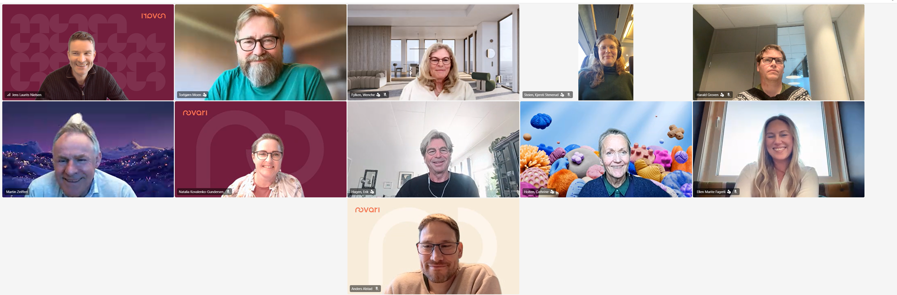

## Oppstartsmøte for Pilot 2: Valg av utdanningsløp!

Onsdag 6 mai var det oppstartsmøte for Pilot 2: Valg av utdanningsløp. Her deltok aktører fra SAMT-BU kjerneteamet og ressurser for Pilot 2. Pilot 2 skal foregå fra Mai - August 2026.

Piloten vil foregå som smidig utvikling med 3 ukers sprinter. Felles møtestruktur (standup) er nå etablert og vi gikk igjennom forslag til hva piloten skal forsøke å besvare opp.

Hvis man er interessert i å lese mer om prosjektet: Felles løft: Sammenhengende tjenester for barn og unge (SAMT-BU) som er fra oktober 2025 til desember 2027, så se mer informasjon her: [https://docs.samt-bu.no/om/.](https://docs.samt-bu.no/om/)

Her (<https://docs.samt-bu.no/behov/use-cases/21-valg-utdanningsloep/>) beskrives også case 21: Valg av utdanningsløp ytterligere (det kan komme endringer i caset etter hvert som vi arbeider i sprintene).

Her fra deltagerne på oppstartsmøtet!

Fra høyre øverst: Jens Laurits Nielsen (Novari), Torbjørn Moen (KS Digital), Wenche Fylken (Digdir), Kjersti Stenerud Steien (Digdir), Harald Groven (Hkdir), Martin Zeiffert (Novari), Natalia Kovalenko-Gundersen (Novari), Erik Hagen (Digdir), Cat (Cahtrine) Holten (Digdir), Ellen Marite Fagerli (Hkdir) og Anders Alstad (Novari).
